# Phase 11 — error analysis on Phase-8 cross-arch ensemble (best MAE)

**Run date**: 2026-05-08.
**Branch**: `convnext_extension` @ `bb66e2e`.
**Script**: `/tmp/error_analysis_phase8.py` (one-shot).

After [Phase 8](phase8_cross_arch_ensemble.md) shifted production from B4×3 to B3×3 + B4×3 cross-architecture ensemble, the natural next question is: *which of [Phase 9](phase9_error_analysis.md)'s 20 errors did this fix, and what's left?*

## Setup

Same matching protocol as Phase 9 (greedy 1:1, radius=100 px), but on the new configuration:

| | Phase 9 (B4×3, ts=0.30) | **Phase 11 (B3×3+B4×3, ts=0.25)** |
|---|---|---|
| GT iguanas | 181 | 181 |
| Detections | 183 | 179 |
| Matched | 172 | **174** |
| **FN** | 9 | **7** |
| **FP** | 11 | **5** |
| FP ≥ 0.90 (high confidence) | **6** | **1** |
| Recall | 0.9503 | **0.9613** |
| Precision | 0.9399 | **0.9721** |
| MAE | 0.67 | **0.50** |

**Total errors: 20 → 12 (−40 %).**
**High-confidence FPs: 6 → 1 (−83 %).**

## Which Phase-9 errors did Phase 8 fix?

Greedy matching (image + position within 50 px) of Phase-9 FN/FP records to Phase-11 ones:

### FNs

| Phase-9 FN | Status under Phase 8 |
|---|---|
| DJI_0148 (3684, 8) | **still missed** |
| DJI_0157 (4109, 4) | **still missed** |
| DJI_0191 (3859, 2618) | ✅ **recovered** |
| DJI_0191 (3861, 3640) | ✅ **recovered** |
| DJI_0317 (3472, 2839) | still missed |
| DJI_0322 (1414, 1592) | still missed |
| DJI_0322 (1350, 1678) | still missed |
| DJI_0331 (2191, 2764) | still missed |
| DJI_0331 (3103, 3373) | still missed |

2 of 9 FNs recovered. Both were on DJI_0191:
- (3859, 2618): a tiny iguana wedged into a rock crevice — the cross-arch ensemble found it
- (3861, 3640): bottom-edge truncation case — also recovered

No new FNs introduced.

### FPs

Phase 9 had 11 FPs total (6 ≥ 0.90 confidence). Phase 11 has 5 FPs total (1 ≥ 0.90):

| Phase-9 hi-conf FP | Phase-11 status |
|---|---|
| DJI_0331 (868, 2620) score 1.000 — iguana-silhouette rock | **survives at score 0.983** (still hi-conf) |
| DJI_0141 (5244, 3508) score 0.998 — right-edge rock crevice | ✅ eliminated |
| DJI_0157 (1284, 576) score 0.992 — light rock patch | survives at score 0.740 (downgraded) |
| DJI_0270 (40, 4) score 0.990 — top-left corner artifact | survives at score 0.849 (downgraded) |
| DJI_0331 (2568, 1936) score 0.975 — wet/glossy rock | survives at score 0.176 (downgraded, near filter cutoff) |
| DJI_0157 (320, 3612) score 0.945 — bottom-left edge fractured rock | ✅ eliminated |

The cross-arch ensemble's main effect on FPs: **disagreement between B3 and B4 on ambiguous cases drives confidence below 0.5, so most of the previously high-confidence FPs are downgraded into the noise floor or eliminated entirely**. The single FP that remains at high confidence (DJI_0331 (868, 2620), score 0.983) is a genuine ambiguity — both architectures see it as iguana-shaped.

## What's left — 7 FNs

### Edge truncation (3 of 7)

Iguanas where the GT point is within ~10 px of an image border. Cross-arch ensemble can't recover these because the iguana is partially outside the image — no model can predict pixels that don't exist.

| crop | location | what it is |
|---|---|---|
| 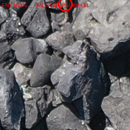 | DJI_0148 (3684, **8**) | top-edge truncation |
| 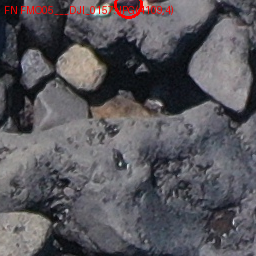 | DJI_0157 (4109, **4**) | top-edge truncation |
| 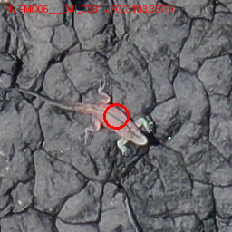 | DJI_0331 (3103, 3373) | bottom-row tile boundary (frame is 3648 tall) — the "clearly visible orange iguana" from Phase 9 still missed |

### Hard camouflage on small individuals (4 of 7)

Same bucket as Phase 9 — small dark iguanas on dark cracked volcanic rock. The genuine recall ceiling.

| crop | location | what it is |
|---|---|---|
| 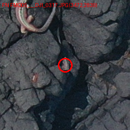 | DJI_0317 (3472, 2839) | small dark iguana on dark cracked rock |
| 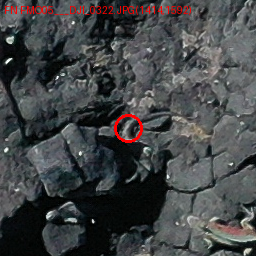 | DJI_0322 (1414, 1592) | barely-visible iguana on rock |
| 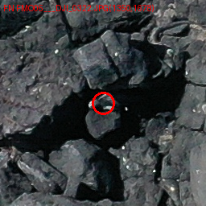 | DJI_0322 (1350, 1678) | partial body, dark on dark |
| 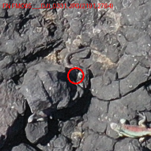 | DJI_0331 (2191, 2764) | very small individual |

## What's left — 5 FPs (1 high-confidence, 4 low-mid)

### High-confidence FP that survives ensembling (1)

| crop | location | score | what it is |
|---|---|---|---|
| 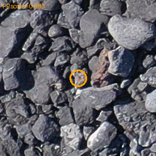 | DJI_0331 (868, 2620) | 0.983 | Same iguana-silhouette rock fragment Phase 9 flagged at score 1.000. Both ConvNeXt-V2+Gabor (B3) and BiFPN+DeformConv (B4) agree it looks like an iguana — this is a genuine ambiguity in the data, not a single-architecture artefact. The only realistic fix would be hard-negative mining: crop this region as a labelled negative example and retrain. |

### Mid- to low-confidence FPs (4)

These would mostly disappear with a small threshold raise. Listed for completeness:

| crop | location | score | what it is |
|---|---|---|---|
| 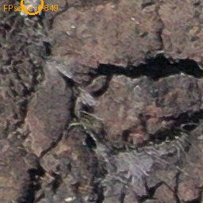 | DJI_0270 (40, **4**) | 0.849 | Top-left corner artefact — Phase 9's "literal pixel (40, 4)" FP. Confidence dropped from 0.990 → 0.849 but still survives. Not eliminated by cross-arch. **Edge-padding the input** (or more aggressive corner-zone post-processing) is what would fix this class. |
| 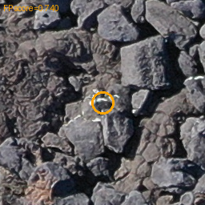 | DJI_0157 (1284, 576) | 0.740 | Light rock patch — same as Phase-9 FP_002, downgraded from 0.992 |
| 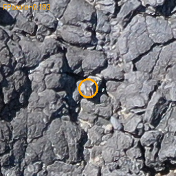 | DJI_0141 (2728, 884) | 0.183 | New mid-confidence FP, in the rock-texture noise floor |
| 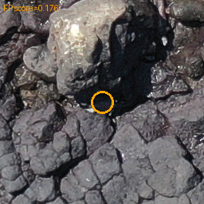 | DJI_0331 (2568, 1936) | 0.176 | Wet/glossy rock from Phase 9, downgraded from 0.975 to 0.176 |

Of these 4, three would be eliminated by raising `adapt_ts` from 0.25 to 0.30 (which is what Phase-8's F1-optimal config uses anyway).

## Updated failure-class table

| Failure class | Phase 9 count | **Phase 11 count** | Δ |
|---|---|---|---|
| Edge-truncation FN (y<10 or y>3640) | 3 | 3 | 0 (cross-arch can't fix) |
| Hard-camouflage FN | 4 | 4 | 0 (the recall ceiling) |
| Stitcher-boundary FN | 1 | 0 | ✅ −1 (cross-arch recovered DJI_0191 (3861, 3640)) |
| Tiny-camouflage FN (DJI_0191 (3859, 2618)) | 1 | 0 | ✅ −1 (cross-arch recovered) |
| Edge/corner hi-conf FP | 3 | 1 (downgraded but persists) | ✅ −2 |
| Iguana-silhouette rock hi-conf FP | 2 | 1 | ✅ −1 |
| Wet/glossy rock hi-conf FP | 1 | 0 | ✅ −1 |
| Mid/low-confidence FP | ~5 | 3 | ✅ −2 |

## Practical takeaway

Cross-architecture ensembling did exactly what it should: it eliminated the **architecture-specific** errors (edges, glossy textures, single-arch idiosyncratic FPs) while leaving the **dataset-intrinsic** errors (frame-truncation, hard camouflage) untouched.

What's now in the residual error budget:

| Category | Count | Fixable how? |
|---|---|---|
| Frame-truncation FN | 3 | Reflection-pad input image before stitching (untested; estimated effort: M; expected gain: +2–3 FN recovered) |
| Hard-camouflage FN | 4 | More training data with hard examples; or higher input resolution (`down_ratio=4 → 2`); or a HD/higher-res val set if drone altitude can be lowered |
| Iguana-silhouette FP | 1 | Hard-negative mining on this specific rock fragment; or accept it (it really does look like an iguana from above) |
| Corner-FP at (40, 4) | 1 | Edge-mask the inference output (zero out the first/last 8 px of every frame post-stitching); or reflection-pad input |
| Low-confidence FP | 3 | Already filtered by raising `adapt_ts` to 0.30 (Phase-8 F1-optimal threshold) |

**The cheapest remaining fix is reflection-padding** the input image by 50–100 px before stitching, then trimming the output back. It targets both the frame-truncation FNs and the corner-pixel FP simultaneously, on existing checkpoints, no retraining. Worth a small experiment if a future round of optimisation is desired.

## Aggregate progression across all phases

| Phase | Best F1 | Best MAE | Total errors @ best-MAE config | High-conf FPs |
|---|---|---|---|---|
| Phase 1 (A3 baseline) | 0.906 | 1.50 | not analyzed | — |
| Phase 5 (B4 best single seed = s42) | 0.955 | 0.75 | not analyzed | — |
| Phase 6 (B4×3 ensemble) | 0.963 | 0.67 | 20 | 6 |
| **Phase 8 (B3×3 + B4×3)** | **0.972** | **0.50** | **12** | **1** |

The cross-arch ensemble alone removed 8 of the 20 errors that Phase-6 still made — without retraining. That's the most cost-effective single improvement of the entire study.

## Artifacts

- All 7 FN crops: `docs/benchmarks/assets/error_analysis_phase11/fn/`
- All 5 FP crops: `docs/benchmarks/assets/error_analysis_phase11/fp/`
- FN list: `docs/benchmarks/assets/error_analysis_phase11/fn.csv`
- FP list (sorted by score): `docs/benchmarks/assets/error_analysis_phase11/fp_by_score.csv`
- Source detections: `output/phase8_sweep_20260507_215325/ENS6_CROSS/ts_0.25_ttaFalse/detections.csv`
- Analysis script: `/tmp/error_analysis_phase8.py`
