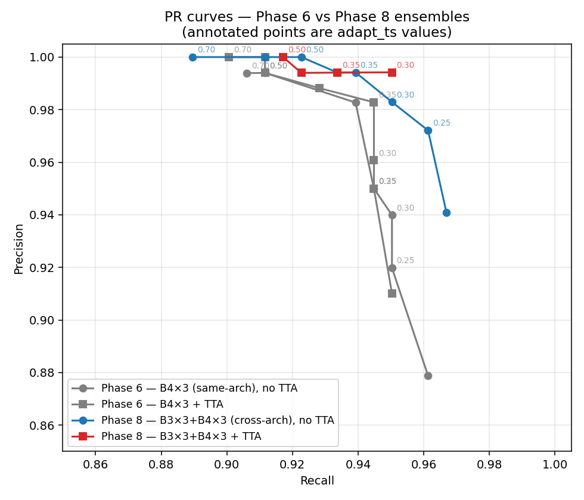
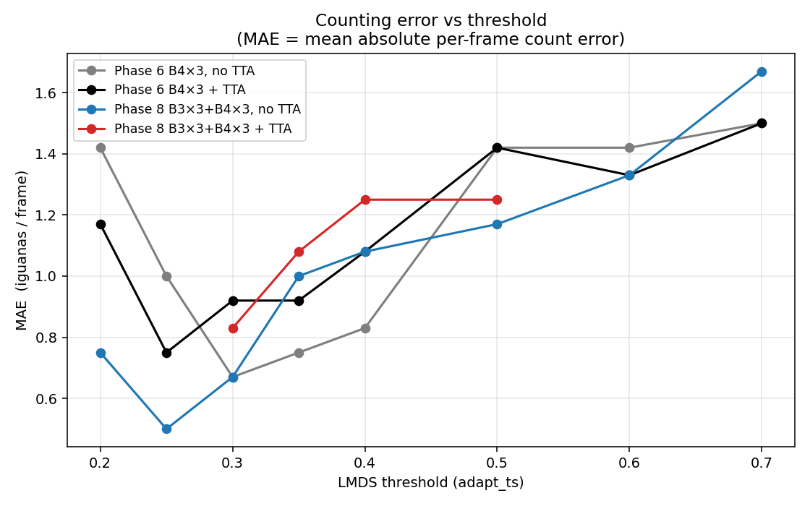
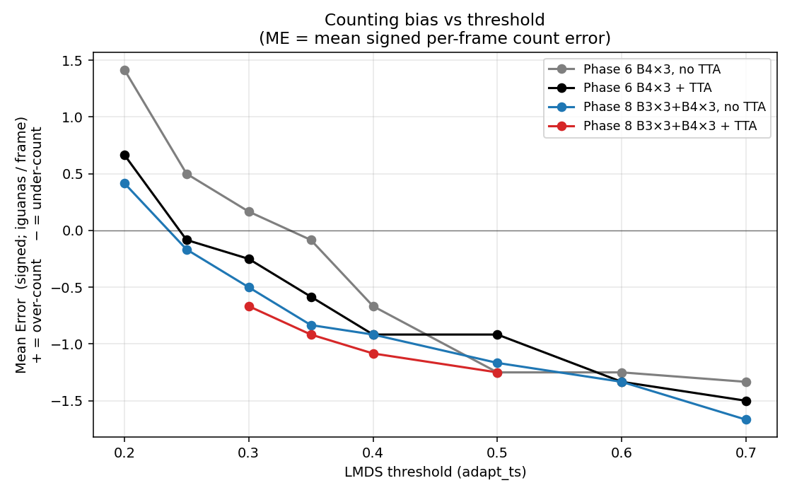
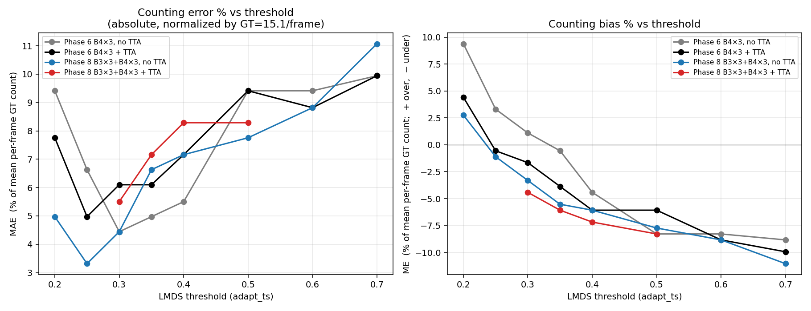
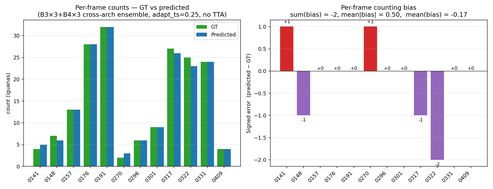

# Phase 12 — diagnostic plots and a note on `adapt_ts`

**Run date**: 2026-05-08.
**Branch**: `convnext_extension` @ `34efa90`.
**Script**: [`tools/plot_metrics.py`](../../tools/plot_metrics.py).

Reads the existing Phase-6 (B4×3 same-arch) and Phase-8 (B3×3+B4×3 cross-arch) sweep CSVs and produces four diagnostic plots, plus a per-image breakdown of the production best-MAE config. All numbers come from data already on disk — no new inference. End of the doc has a discussion of what `adapt_ts` actually does and why the current implementation makes threshold tuning expensive.

## Plots

### 1. Precision–Recall, all four ensembles



Each annotated point is the `adapt_ts` value at that operating point. Phase 8 cross-arch (blue and red) sits **strictly above and to the right** of Phase 6 same-arch (gray and black) at every threshold — a Pareto improvement, not a trade-off. Cross-arch + TTA (red) holds precision ≥ 0.99 across the full recall range we tested (0.92 → 0.95). Cross-arch no-TTA (blue) reaches the highest recall (0.961 at ts=0.25) while still keeping precision at 0.97.

### 2. MAE vs threshold



Counting accuracy as a function of the LMDS threshold. The cross-arch ensemble's no-TTA curve (blue) hits **MAE = 0.50 at ts=0.25** — clearly the single best operating point. Both Phase-6 baselines bottom out at 0.67 (a quarter-iguana worse). All four curves rise sharply past ts=0.50 as the model under-counts.

### 3. Mean Error (signed) vs threshold



Mean Error = predicted_count − GT_count, averaged per frame. Positive = over-counting, negative = under-counting. The horizontal line at ME = 0 is the unbiased operating point.

Reading the curves:
- At low thresholds (ts ≤ 0.25) the model **over-counts** because too many low-confidence FPs survive LMDS.
- At high thresholds (ts ≥ 0.50) the model **under-counts** because LMDS suppresses real but lower-confidence detections.
- The unbiased crossover for the Phase-8 cross-arch ensemble is right around `ts ≈ 0.27`, almost exactly where MAE is also minimised (0.25). That's a nice property — the threshold that minimises absolute counting error also minimises systematic bias.

### 4. Same as %, normalised by per-frame GT count (15.08 iguanas/frame)



Same MAE and ME, but expressed as a percentage of the mean per-frame GT count.

At the production operating point (Phase-8 cross-arch, no TTA, ts=0.25):
- **MAE = 3.3 %** of mean per-frame count
- **ME = −1.1 %** (a slight under-count bias of ~⅛ iguana per frame)

For comparison, the older Phase-6 same-arch best-MAE was MAE = 4.4 % / ME = +1.1 % (slight over-count).

### 5. Per-frame breakdown at the production operating point



The 12 val frames at the production config (Phase-8, ts=0.25, no TTA):

| frame | GT | predicted | bias | bias % |
|---|---|---|---|---|
| 0141 | 4 | 5 | +1 | +25.0 % |
| 0148 | 7 | 6 | −1 | −14.3 % |
| 0157 | 13 | 13 | 0 | 0 |
| 0176 | 28 | 28 | 0 | 0 |
| 0191 | 32 | 32 | 0 | 0 |
| 0270 | 2 | 3 | +1 | +50.0 % |
| 0296 | 6 | 6 | 0 | 0 |
| 0301 | 9 | 9 | 0 | 0 |
| 0317 | 27 | 26 | −1 | −3.7 % |
| 0322 | 25 | 23 | −2 | −8.0 % |
| 0331 | 24 | 24 | 0 | 0 |
| 0409 | 4 | 4 | 0 | 0 |

**8 of 12 frames have zero counting error.** The remaining 4 frames are off by ±1 or −2 iguanas. Total bias across all 12 frames: −2 (under-count by 2 across the whole val set).

The percentage column shows the small-sample artefact clearly: DJI_0270 has GT=2 and we predict 3 — that's a single iguana of error but reads as "+50 %". The two frames where the bias-percentage looks bad (0141 +25 %, 0270 +50 %) are precisely the frames with the smallest GT counts. **Per-frame %-bias is misleading on small-population frames; aggregate bias and the absolute error are the metrics to ship.**

## What `adapt_ts` actually does

`adapt_ts` is the LMDS adaptive threshold. From `animaloc/eval/lmds.py:117-143`:

```python
def _lmds(self, est_map):
    est_map_max = torch.max(est_map).item()
    est_map = self._local_max(est_map)              # spatial NMS via max-pool
    est_map[est_map < self.adapt_ts * est_map_max] = 0   # ← adapt_ts here
    ...
```

It is **not** an absolute confidence threshold. It's a fraction of the *per-tile maximum heatmap value*: a local maximum survives only if its value is ≥ `adapt_ts × tile_max`.

So `adapt_ts = 0.30` means *"keep local maxima ≥ 30 % of the brightest peak in this tile"*. The threshold scales adaptively with the tile's overall brightness — useful because:
- A tile with strong iguana evidence (high `tile_max`) demands high-confidence peaks.
- A tile that's mostly background (low `tile_max`) can have proportionally weaker peaks survive — but the absolute `neg_ts` cutoff zeroes the whole tile if `tile_max < neg_ts` (line 131), which prevents background-only tiles from emitting any detections.

This relative-to-max design is why the threshold sweep curves look the way they do:
- The same `adapt_ts = 0.30` produces *different* effective absolute confidence cutoffs in different tiles.
- An iguana-rich tile and a sparse tile both filter at "30 % of peak", but those 30 %-of-peak values can be 0.6 vs 0.05 in absolute terms.

## Why threshold tuning is currently more expensive than it should be

Your concern is legitimate. The current pipeline is:

```
[ stitcher: tile + forward + merge → full-size heatmap ] → [ LMDS @ adapt_ts ] → metrics
```

In a threshold sweep, *both* boxes re-run for every value of `adapt_ts`. The first box is expensive (~30 s for a single B4 forward; ~3 min for the 6-model cross-arch ensemble; ~12 min with TTA) and **does not depend on `adapt_ts` at all**. The second box is essentially free (<1 s) and is the only part that actually consumes `adapt_ts`.

So our 8-threshold Phase-8 sweep cost ~8 × 12 min = ~96 min when it could have cost ~12 min for one inference plus a sub-second LMDS reapplication for each threshold — a 7–8 × waste.

This is a real architectural smell. Two parts of the codebase already work around it in different ways:

1. **`tools/inference_hparam_search.py`** already implements the right pattern for the cropped-val regime (`_load_model_outputs` caches per-tile heatmap+cls outputs to disk, then `evaluate_cached` reapplies LMDS at sweepable parameters). It just doesn't operate on full-size stitched data.
2. **`run_phase{6,8,10}_*.sh`** repeatedly invoke `tools/infer.py --evaluate` once per threshold — the brute-force path.

### What a fix would look like

A small refactor of `tools/infer.py` (or a new `tools/infer_then_sweep.py`) to:

1. Run inference once. Save the **stitched** full-size heatmap + classification map per image (probably as `.npy` or `.pt` files alongside `detections.csv`).
2. Take an `--adapt-ts` *list* on the CLI. For each value, reapply `HerdNetLMDS` to the cached stitched maps and emit a separate `metrics_results.csv`.
3. Write a single combined sweep CSV (the same shape `phase{6,8,10}*.csv` files already use).

Estimated effort: M (~1 day). Estimated speedup on threshold sweeps: 7–10 × for ensemble + TTA configs. The current outputs would still be reproducible bit-for-bit; only the wall-clock changes.

This isn't blocking the production stack — Phase 8's numbers stand — but it's the right cleanup before doing any future LMDS-parameter exploration (e.g. `kernel_size`, `neg_ts` sweeps that are even more expensive at full-size today).

A secondary fix worth noting: the `adapt_ts` documentation in `lmds.py:35-46` is sparse. Adding an explicit comment that this is *relative-to-tile-max*, not absolute confidence, would save the next reader (and a couple of past us) from confusion when reading sweep curves.

## Files

- Plots: `docs/benchmarks/assets/plots/{pr_curve,mae_vs_threshold,me_vs_threshold,error_pct,per_image_error}.png`
- Per-frame data: `docs/benchmarks/assets/plots/per_image_error.csv`
- Plot script: `tools/plot_metrics.py`
- Source data:
  - Phase 6 sweep: `output/phase6_sweep_20260507_124034/{T2_ensemble_no_tta.csv, T3_ensemble_tta.csv}`
  - Phase 8 sweep: `output/phase8_sweep_20260507_215325/{T1_cross_arch_no_tta.csv, T2_cross_arch_tta.csv}`
  - Production detections: `output/phase8_sweep_20260507_215325/ENS6_CROSS/ts_0.25_ttaFalse/detections.csv`
