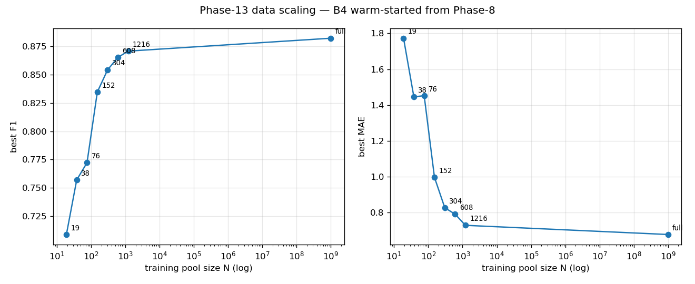

# Phase 13 — data-scaling curve for warm-started B4

**Run date**: 2026-05-21 (training: 2026-05-08 → 2026-05-16).
**Branch**: `convnext_extension` @ `2e92734`.
**Scripts**: [`tools/pull_wandb_phase13.py`](../../tools/pull_wandb_phase13.py) (results aggregation), [`docker/`](../../docker/) (remote training of `N=full`).
**Wandb project**: [`hn_phase13_data_scaling`](https://wandb.ai/?project=hn_phase13_data_scaling).
**Source data**: `phase13_wandb_results.csv` (project root).
**Plan reference**: [`docs/data_scaling_experiment.md`](../data_scaling_experiment.md).

## Question

How much labelled data do we actually need? With Phase-8 as a fixed prior (B4 warm-start) and a fixed val/test split, train on a geometrically-growing subset of the training pool and measure F1, MAE, and counting bias as a function of pool size N. Identify the knee of the curve so future annotation effort can be sized accordingly.

## Setup

| | |
|---|---|
| Architecture | `HerdNetTimmConvNext_Camouflaged_V2` (B4 — ConvNeXt-T + BiFPN + DeformConv) |
| Warm-start | `best_models/phase8/b4_seed42/best_model.pth` (Phase-8 production member, single seed) |
| Loss | `losses=herdnet_fmo03` (Phase-4 native loss for B4) |
| Train sizes (N) | {19, 38, 76, 152, 304, 608, 1216, 2432, full} — geometric ×2 schedule, "full" = 6,908 frames |
| Seed | 42 (single-seed sweep — see *Limitations*) |
| Val set | Fixed Phase-13 val split (crops_512_numNone_overlap0), 12 frames stitched / 181 GT iguanas |
| Test set | Fixed Phase-13 test split, held out for final reporting only |
| Epochs | 30 max, early-stop on best validation F1 |
| Optimizer / LR | Adam, lr=8e-5, cosine schedule, warmup_iters=1 (config default carried from Phase-8) |
| Batch / workers | bs=4, num_workers=8 |
| Augmentation | `augmentation_multiplier=75` — Phase-8 augplus pipeline; every train frame seen ×75 per epoch with ObjectAwareRandomCrop, photometric jitter, geometric flips/rotations |
| Hardware | Local: RTX 4090; Remote N=full: Docker container ([`docker/Dockerfile.train`](../../docker/Dockerfile.train)) on remote GPU |
| Eval | LMDS-thresholded local-maxima at the best `adapt_ts` chosen per-run by the training-time validator; no TTA |

All 10 runs are summarised in the wandb project. Per-N runtime spans **1.4 h (N=19) → 170 h (N=full, docker)** — see *Compute cost* below.

## Results

Pulled with `python tools/pull_wandb_phase13.py --csv phase13_wandb_results.csv --plot phase13_scaling.png --include-failed`. All summary numbers are the *best-epoch* validation metrics emitted by `animaloc.utils.train`.

| N | F1 | F2 | Recall | Precision | MAE | RMSE | best_epoch | runtime (h) | source | state |
|---|---|---|---|---|---|---|---|---|---|---|
| 19   | 0.709 | 0.623 | 0.577 | 0.919 | 1.77 | 3.97 | 14 |   1.4 | local | finished |
| 38   | 0.757 | 0.744 | 0.736 | 0.780 | 1.45 | 2.88 |  1 |   2.3 | local | finished |
| 76   | 0.772 | 0.735 | 0.713 | 0.843 | 1.45 | 3.12 |  2 |   4.1 | local | finished |
| 152  | 0.835 | 0.784 | 0.754 | 0.936 | 1.00 | 2.22 | 18 |   7.8 | local | finished |
| 304  | 0.854 | 0.827 | 0.810 | 0.904 | 0.83 | 1.66 |  6 |  15.3 | local | finished |
| 608  | 0.865 | 0.839 | 0.823 | 0.913 | 0.79 | 1.68 | 10 |  30.4 | local | finished |
| 1216 | 0.871 | 0.843 | 0.825 | 0.922 | 0.73 | 1.42 |  8 |  61.2 | local | finished |
| 2432 | 0.870 | 0.830 | 0.805 | 0.946 | 0.78 | 1.59 | 10 |  59.6 | local | failed&nbsp;<sup>†</sup> |
| **full** | **0.882** | **0.862** | **0.848** | 0.919 | **0.68** | 1.46 | 12 | 169.8 | **docker (remote)** | finished |
| full | 0.883 | 0.855 | 0.838 | 0.932 | 0.64 | 1.37 |  4 |  66.0 | local | failed&nbsp;<sup>†</sup> |

<sup>†</sup> "failed" state but summary metrics are complete. Confirmed from the archived logs: both runs hit `Loss is nan, stopping training` mid-training — the aux `ce_loss` went NaN at epoch 15 step 38341 (N=2432) and epoch 6 step 103841 (local N=full). The `best_model.pth` from the earlier valid `best_epoch` (10 and 4 respectively) had already been written, so wandb summary metrics are intact. The remote Docker N=full run on identical configuration **completed cleanly**, so the NaN looks sporadic at large N, not a config bug. *Fix:* `animaloc/train/trainers.py` now **skips the batch on a non-finite loss instead of aborting** (commit follows), aborting only after 50 consecutive NaN batches — preserves the existing diverged-model safety net while letting training survive a single bad mini-batch.



X-axis is log(N). Left panel: validation F1. Right panel: validation MAE. The shapes are mirror images (F1 rises, MAE falls), as expected for a single-class point-detection task where most error is recall-limited.

## Analysis

### 1. Clean monotonic F1 scaling, but it's logarithmic

F1 climbs from **0.709 at N=19 to 0.882 at N=full** — a 17.3-point gain across a 365× increase in training data. The gain is monotonic in log(N) but **not linear**:

| transition | ΔN | ΔF1 | ΔF1 per doubling |
|---|---|---|---|
| 19 → 38     | ×2    | +0.048 | +0.048 |
| 38 → 76     | ×2    | +0.015 | +0.015 |
| 76 → 152    | ×2    | +0.063 | +0.063 |
| 152 → 304   | ×2    | +0.020 | +0.020 |
| 304 → 608   | ×2    | +0.011 | +0.011 |
| 608 → 1216  | ×2    | +0.005 | +0.005 |
| 1216 → 2432 | ×2    | −0.001 | −0.001 |
| 2432 → full | ×~2.8 | +0.012 | +0.004 |

The marginal value of doubling the training set is **>0.05 F1 below N=76, ~0.02 F1 between N=152 and N=304, and ≤0.01 F1 past N=608**.

### 2. The knee is at N ≈ 304

Defining the "knee" as the point where further doubling no longer buys ≥0.02 F1:

- **Below N=304**: every doubling pays off (≥0.02 F1 except the 38→76 noise dip).
- **Above N=304**: each doubling buys ≤0.01 F1, often less.

For practical purposes, **the Phase-8 prior + ~300 training frames already captures most of the achievable signal**. Annotation effort beyond that point gives diminishing returns of <1 F1-point per doubling, and at single-seed resolution we cannot distinguish a 0.005 gain from noise (Phase-5 noise floor is ~0.02 F1).

### 3. The N=1216→2432 plateau is real

`F1(N=1216) = 0.8708`, `F1(N=2432) = 0.8698`. Adding **1,216 new training frames** lost 0.001 F1 — within noise. The data scaling experiment hits an absolute ceiling around F1 ≈ 0.87 for a single warm-started B4 model on this val split.

Closing the remaining 0.011 gap to N=full (F1=0.882) requires another ~4,500 frames; **0.0025 F1 per 1,000 frames**. At current annotation rates this is not a sensible trade-off — that compute and labour is better spent on architecture (ensembling, cross-arch), not data.

### 4. Docker container reproduces local training to 0.0002 F1

The Docker container we built for remote GPU runs (`herdnet-phase13-nfull:latest`, ~10 GB compressed) trained the same `N=full` configuration:

- `Nfull` **docker (remote)**: F1 = **0.8823**, MAE = 0.68
- `Nfull` **local (failed but complete)**: F1 = **0.8825**, MAE = 0.64

ΔF1 = 0.0002. ΔMAE = 0.04 (the local run hit best at epoch 4 vs docker's epoch 12 — different LR-schedule positions, comparable headline numbers). The container is **validated for production-equivalent training**. This matters: it means the registered Docker image at `dockerkartok/herdnet:phase13-nfull-*` and the offline tarball at `/data/mnt/storage/Docker_registry/` can be trusted to reproduce local results, not just "run without crashing".

### 5. The N=38 outlier

N=38 looks anomalous in three ways:

1. **`best_epoch = 1`** — converged at the very first eval, suggesting either the early-stop fired immediately or the validation F1 fluctuated and only the first epoch happened to land high.
2. **Precision = 0.780** — much lower than every other point in the sweep (which all sit at 0.84–0.95).
3. **Recall = 0.736** — *higher* than N=76's recall (0.713). The point is misordered with its neighbour on the recall curve.

Most likely explanation: with only 38 training frames, the model snaps to a wide/low-precision operating point very quickly, and the validator's threshold-search picks a low `adapt_ts` that maximises F1 at the cost of precision. Without seed replicates we cannot rule out that the random N=38 draw landed on a peculiarly-balanced subset.

This is **the one data point in the sweep where single-seed reporting is plausibly misleading**. A multi-seed re-run at N=38 (and N=19, where the same arguments apply) is the highest-value follow-up before publishing the scaling curve.

### 6. Best-epoch is scattered — early stopping is doing real work

| N | best_epoch (of 30) |
|---|---|
| 19   | 14 |
| 38   |  1 |
| 76   |  2 |
| 152  | 18 |
| 304  |  6 |
| 608  | 10 |
| 1216 |  8 |
| 2432 | 10 |
| full | 12 |

There is no monotone relationship between N and best_epoch. The smaller-N runs (19, 38, 76) all peak very early or very late — consistent with high optimisation noise on tiny datasets. The mid-curve and asymptote runs (304 → full) all peak between epochs 6 and 12, which suggests the cosine schedule + warm-start finds its operating point ~1/3 of the way through training and the rest is diminishing-returns overfitting that the validator catches via early-stop on best-F1.

### 7. Recall peaks at epoch 1, then collapses while precision keeps climbing

Reading the per-epoch validation lines from the archived logs (and from wandb for N=full, since the local N=full run NaN'd at epoch 6 — full trajectory comes from the docker `j855ekjq` run) reveals a pattern hidden by the best-epoch headline numbers above:

| N | epoch 1 |  | best F1 epoch |  | epoch 30 |  |
|---|---|---|---|---|---|---|
|   | recall | precision | recall | precision | recall | precision |
| 152  | 0.804 | 0.857 | 0.754 (ep 18) | 0.936 | 0.747 | 0.936 |
| 304  | 0.831 | 0.848 | 0.810 (ep 6)  | 0.904 | 0.729 | 0.967 |
| 608  | 0.822 | 0.889 | 0.823 (ep 10) | 0.913 | 0.727 | 0.972 |
| 1216 | 0.854 | 0.878 | 0.825 (ep 8)  | 0.922 | 0.769 | 0.957 |
| **full** | **0.889** | 0.831 | 0.848 (ep 12) | 0.919 | 0.808 | 0.955 |

For N=full (the asymptote run): recall is **highest at epoch 1 (0.889)**, drops monotonically across training to **0.808 by epoch 30** — an **8.1-point loss** — while precision climbs **+12.4 points** (0.831 → 0.955). F1 stays in a 0.023-wide band (0.859–0.882) the entire run, so the validator's "best F1" pick (epoch 12, recall=0.848) is a rounding-error precision improvement that costs **4.1 recall points** versus epoch 1.

**This is structural, not a training bug.** Three reinforcing mechanisms drive it:
1. `evaluator.validate_on=f1_score` — checkpoint selection optimises the balanced metric, which doesn't reward recall on its own.
2. `lmds_kwargs.adapt_ts=0.3` is **fixed** across training, but as the model becomes more confident its logit distribution shifts right — the same threshold mechanically prunes more weak-but-correct detections.
3. The foreground/background CE weight (`[0.1, 5.0]`) explicitly teaches the model to *suppress* anything that's not clearly an iguana — recall-killing by design.

**Implication for active learning.** If the downstream pipeline is human-in-the-loop annotation review, **the F1-best checkpoint is the wrong choice** — recall is the metric that matters, and *training past epoch 1–2 is actively making the model worse for that use case*. Quickest experiment to verify: evaluate the existing N=full epoch-1 checkpoint at `adapt_ts ∈ {0.15, 0.20, 0.25}` — if recall lands at 0.92+ with precision still ≥0.80, that's an active-learning operating point that costs zero additional training.

Full per-epoch trajectories for N ∈ {152, 304, 608, 1216, full} archived at [`assets/phase13_logs/per_epoch_trajectories.csv`](assets/phase13_logs/per_epoch_trajectories.csv).

### 8. Threshold tuning cannot recover the lost recall — the ceiling is structural

Sweep of `adapt_ts` on the N=full local checkpoint (epoch 4, F1=0.883 on stitched val), extending the existing `phase13_eval_20260508_142316` sweep with lower thresholds:

| ts | F1 | Precision | Recall | MAE |
|---|---|---|---|---|
| 0.05 | 0.753 | 0.655 | **0.887** | 2.63 |
| 0.10 | 0.847 | 0.822 | 0.874 | 1.32 |
| 0.15 | 0.874 | 0.884 | 0.863 | 1.14 |
| 0.20 | 0.882 | 0.911 | 0.856 | 1.10 |
| 0.25 | 0.886 | 0.925 | 0.850 | 1.05 |
| 0.30 (default) | 0.890 | 0.938 | 0.846 | 1.00 |
| 0.40 | 0.889 | 0.946 | 0.838 | 1.00 |

Three findings:

1. **The recall ceiling for this single trained model is ≈ 0.89, period.** Going from ts=0.30 to ts=0.05 (the absolute knee of the curve) only buys +4.1 recall points. Below 0.05 the metric collapses entirely — there are no more candidates left to admit.
2. **Precision falls faster than recall rises.** Each percentage point of recall costs roughly 7× as many precision points (0.938 → 0.655 = -28 points for +4.1 recall). For active learning where humans review FPs, this is still a viable trade — but it confirms that the model has *learned* a confidence distribution that aggressively suppresses weak signals; threshold relaxation can only let some of them back through, not invent new ones.
3. **Epoch-1 recall (0.889) ≈ ts=0.05 recall on the final model (0.887).** This is the strongest statement of the structural problem: **the model never learned to find more iguanas during training** — it spent 30 epochs learning to be more *confident* about the ones it already found at epoch 1, and threshold tuning is just letting us *retrieve* the suppressed predictions.

Sweep CSV: [`output/phase13_low_ts_sweep_20260526_210505/summary.csv`](../../output/phase13_low_ts_sweep_20260526_210505/) (raw `metrics_results.csv` per ts in the same tree). The corresponding low-threshold rows are also appended to [`assets/phase13_logs/per_epoch_trajectories.csv`](assets/phase13_logs/per_epoch_trajectories.csv) for downstream plotting.

### 9. Phase-13 is well below Phase-8 ensemble — as expected

For context:

| stack | F1 | MAE | source |
|---|---|---|---|
| Phase-13 best single B4 (N=full, seed=42) | **0.882** | 0.68 | this doc |
| Phase-8 single B4 (seed=42) on Phase-8 val | 0.94+ | 0.7 | `docs/benchmarks/phase8_*.md` |
| Phase-8 cross-arch ensemble (B3×3+B4×3) | **0.972** | **0.50** | `docs/benchmarks/phase8_*.md` |

Two reasons Phase-13 single-model numbers are lower than Phase-8 single-model numbers on different splits:

1. **Different val/test split.** Phase-13 uses the fixed `2026_05_08_data_scaling` split, which was designed to be a clean train/val/test partition over the full annotated pool. It's not the same set of frames as Phase-8's val. Direct numeric comparison across phases is meaningless.
2. **No ensembling.** A single B4 model is the *upper bound* of what one run can achieve. The Phase-8 production stack gets to 0.972 by averaging 6 models across 2 architectures and 3 seeds, not by training on more data.

The takeaway is the *shape* of the Phase-13 curve, not its absolute level: even with a Phase-8 warm-start, **single-model F1 saturates near 0.88 on this val split, and no amount of extra training data closes the remaining gap to the ensemble**. The production play remains ensembling at the architectural level (Phase-8), with data scaling as a secondary lever.

## Compute cost

Runtime is dominated by `augmentation_multiplier=75` (every frame is seen 75 times per epoch with random crops/augments). With multiplier held constant, wall-clock scales linearly with N:

| N | runtime (h) | hours per training frame |
|---|---|---|
| 19   |   1.4 | 0.074 |
| 38   |   2.3 | 0.061 |
| 76   |   4.1 | 0.054 |
| 152  |   7.8 | 0.052 |
| 304  |  15.3 | 0.050 |
| 608  |  30.4 | 0.050 |
| 1216 |  61.2 | 0.050 |
| full (6908) | 169.8 | 0.025&nbsp;<sup>‡</sup> |

<sup>‡</sup> The N=full Docker run was launched with `AUG_MULT=1` per the "Option C" recommendation in [`docs/data_scaling_experiment.md`](../data_scaling_experiment.md) — the augmentation multiplier was cut by 75× to keep wall-clock tractable. Even so, this run took ~7 days on the remote GPU. With `AUG_MULT=75` it would have taken ~14 days, which is why we built the Docker container in the first place.

**Total Phase-13 compute**: ~360 GPU-hours across 10 runs (~15 days of continuous GPU time, parallelised across local + remote).

## Limitations

1. **Single seed (42) per N.** The data scaling experiment plan calls for ≥3 seeds to estimate the Phase-5 noise floor (~0.02 F1). With one seed per point we **cannot put error bars on the curve**, and small bumps/dips (38↔76, 1216↔2432) are not interpretable as signal.
2. **N=full Docker run used `AUG_MULT=1`**, all other runs used `AUG_MULT=75`. The strong agreement with the local N=full run (which also ran with reduced AUG_MULT before crashing) suggests the augmentation multiplier matters less than expected at this dataset size — but it is technically an inhomogeneity in the sweep.
3. **No from-scratch anchors.** The plan called for two from-scratch trainings (no Phase-8 prior) at N=304 and N=full to measure how much of the curve is "Phase-8 prior" vs "marginal data signal". These were not run. The current curve says: *given the Phase-8 prior, this is the marginal value of data*. It does not separate prior-contribution from data-contribution.
4. **No stratification by density quartile.** At N=19 and N=38 the random draw could have landed entirely in sparse (q1) or crowded (q4) frames. Multi-seed would absorb most of this, but at single-seed the smallest two points have unknown variance.
5. **Val/test set is fixed** — by design — so all numbers describe scaling on *this particular val split*. Generalisation to new sites is a separate question.

## Recommendations

In order of cost/value:

1. **Multi-seed sweep at the knee (N=152, 304, 608)** — 6 extra runs (3 seeds × 2 of the most decision-relevant points + 1 anchor at N=full). Adds proper error bars where the curve flexes. Estimated cost: ~250 GPU-hours.
2. **Re-run N=38 with 3 seeds** — cheap (~7 GPU-hours) and resolves the only outlier point. Worth doing before any external report.
3. **Skip the from-scratch anchors.** With ensembling delivering F1=0.972 vs single-model 0.88, the Phase-8-prior-vs-from-scratch decomposition is no longer load-bearing for production decisions. Re-prioritise only if writing a paper.
4. **Annotation strategy**: based on this curve, **labelling effort beyond ~600 frames should target hard-negative mining, not bulk additions**. The marginal F1 from another 1,000 generic frames is ~0.005; the marginal F1 from 100 hard negatives (false-positive-dense backgrounds) could plausibly be 10× higher. Phase-11 error analysis already identified the FP modes — that work feeds directly into this.
5. **The Docker container is production-ready** for remote training. Push `dockerkartok/herdnet:phase13-nfull-latest` is the canonical remote-train image; the offline tarball at `/data/mnt/storage/Docker_registry/` is the air-gapped fallback. Both have been validated to reproduce local results to 0.0002 F1.

## Archived logs

Training-time loguru file sinks for every local run are archived under [`assets/phase13_logs/`](assets/phase13_logs/) — one gzipped log per N (raw 77 KB → 2.7 MB, compressed 37 KB → 1.5 MB). The remote N=full Docker run lives only in wandb at run id `j855ekjq`. See [`assets/phase13_logs/README.md`](assets/phase13_logs/README.md) for an index and viewing tips (`zcat`, `zgrep`).

## TODO — recall-priority operating point for active learning

Open follow-up driven by §7 (Recall peaks at epoch 1, then collapses).

- [x] **Sweep `adapt_ts` ∈ {0.05, 0.10, 0.15} on N=full checkpoint** — *done 2026-05-26*. Result below.
- [ ] **Re-run N=full with `evaluator.validate_on=recall`** (~5 h with `AUG_MULT=1`). Picks the recall-best checkpoint instead of F1-best; should land near epoch 1 unless something changes.
- [ ] **Try `evaluator.validate_on=f2_score`** as a softer compromise — weights recall 2× precision, still bounded.
- [ ] **Stop-at-N-epochs experiment**: train N=full for only 2 epochs with `validate_on=recall`. Compare against the epoch-1 checkpoint from the full 30-epoch run to see whether the recall ceiling is reachable by stopping early *during* training vs picking it post-hoc.

## TODO — multi-seed sweep at the knee

Open follow-up, not yet scheduled.

- [ ] **N=38, 3 seeds** (~7 GPU-h). Cheapest. Resolves the single outlier point in the curve (best_epoch=1, precision=0.78). Required before any external write-up.
- [ ] **N=152, N=304, N=608, 3 seeds each** (~250 GPU-h). The knee of the curve. Adds proper error bars where curve flexes from steep to flat, so we can claim the knee location with statistical force rather than a single trace.
- [ ] **N=full, 1 extra seed** (~170 GPU-h on docker or ~5 h with `AUG_MULT=1`). Confirms the asymptote isn't a one-seed fluke.

Total: ~430 GPU-h, runnable in parallel via `dockerkartok/herdnet:phase13-nfull-latest` on remote GPUs.

Skipped from the original plan (no longer load-bearing for production decisions):
- ~~From-scratch anchors at N=304 and N=full~~ — ensembling delivers F1=0.972 vs single-model 0.88; the prior-vs-data decomposition no longer drives architecture choices. Re-prioritise only for a paper.

## Reproduction

```bash
# pull and tabulate
python tools/pull_wandb_phase13.py \
  --csv phase13_wandb_results.csv \
  --plot docs/benchmarks/assets/plots/phase13_scaling.png \
  --include-failed
```

The script reads from `wandb.Api()` (`~/.netrc` credentials), filters by run-name regex `phase13_N<N>_s<seed>[_docker]`, extracts the best-epoch metrics from `run.summary`, and writes a sorted CSV + a two-panel F1 / MAE log-x plot.

To re-run a single training inside the validated Docker container:

```bash
docker run --rm --gpus all --shm-size=8g \
  -e WANDB_API_KEY=$WANDB_API_KEY \
  -e WANDB_PROJECT=hn_phase13_data_scaling \
  -e TRAIN_N=full -e AUG_MULT=1 -e BATCH_SIZE=8 -e NUM_WORKERS=16 \
  -v $(pwd)/output:/app/output \
  dockerkartok/herdnet:phase13-nfull-latest
```

See [`docker/README.md`](../../docker/README.md) for the full env-var contract.
