# Phase 9 — qualitative error analysis on the production stack

**Run date**: 2026-05-07.
**Branch**: `convnext_extension` @ `c79ee69`.
**Script**: `/tmp/error_analysis.py` (one-shot).

After Phase 6 settled the production stack at F1 ≈ 0.96 / MAE ≈ 0.67, the remaining question stopped being *"which knob raises the metric?"* and became *"what does the model still get wrong, and why?"*. This phase looks at every error the production stack still makes on the FMO03 val set and characterizes them.

## Setup

Model: **3-seed ensemble of B4** (`fmo03_full_v2_bifpn`, ConvNeXt-T + BiFPN + DeformConv, `losses=herdnet_fmo03`), at `adapt_ts=0.30`. This is the Phase-6 best-MAE config: **F1=0.945, P=0.94, R=0.95, MAE=0.67** on full-size stitched eval (12 val frames, 181 GT iguanas, 183 detections).

Detections file: `output/phase6_sweep_20260507_124034/ENS3/ts_0.30_ttaFalse/detections.csv`.

Method:
1. Greedy 1:1 matching between predictions and GT within `radius=100 px` (the evaluator's existing matching radius, also the typical iguana-body span at this altitude).
2. Anything unmatched on the GT side → false negative. Anything unmatched on the detection side → false positive.
3. Crop a 256×256 patch centred on each error; mark the GT location (red circle) for FNs or the predicted location (orange circle) for FPs.
4. Sort FPs by confidence descending so the high-confidence ones are inspected first.

## Aggregate

| | count |
|---|---|
| GT iguanas | 181 |
| Detections | 183 |
| Matched | 172 |
| **FN (missed GT)** | **9** |
| **FP (extra detect)** | **11** |
| Recall | 0.9503 |
| Precision | 0.9399 |

### FP score distribution

| score band | count |
|---|---|
| ≥ 0.99 | 3 |
| ≥ 0.90 | 6 |
| ≥ 0.70 | 6 |
| ≥ 0.50 | 9 |
| < 0.50 | 2 |

**6 of 11 FPs come at confidence ≥ 0.90.** These are the dangerous ones — they look like iguanas to the model.

### Per-frame breakdown

| frame | FN | FP | hi-FP (≥0.7) |
|---|---|---|---|
| FMO05___DJI_0141 | 0 | 2 | 1 |
| FMO05___DJI_0148 | 1 | 2 | 0 |
| FMO05___DJI_0157 | 1 | 2 | 2 |
| FMO05___DJI_0191 | 2 | 1 | 0 |
| FMO05___DJI_0270 | 0 | 1 | 1 |
| FMO05___DJI_0317 | 1 | 0 | 0 |
| FMO05___DJI_0322 | 2 | 1 | 0 |
| FMO05___DJI_0331 | 2 | 2 | 2 |

Errors are spread across 8 of 12 val frames; no single frame dominates.

## False negatives — 9 missed iguanas

GT location marked with red circle. All 9 shown below in their `(image, x, y)` order.

### Edge truncation (3 of 9)

Iguanas where the GT point lies within ~10 px of an image border — partially cut off, partially in the stitcher's lowest-overlap region.

| crop | location | what it is |
|---|---|---|
| 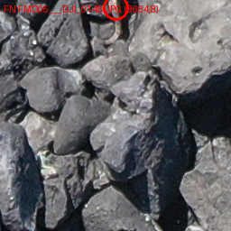 | DJI_0148 (3684, **8**) | Iguana visible at top edge — head/body partially cut off by the y=0 frame border |
| 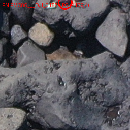 | DJI_0157 (4109, **4**) | Same pattern: visible iguana truncated by top edge (y=4) |
| 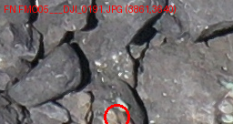 | DJI_0191 (3861, **3640**) | Bottom-edge truncation (frame is 3648 tall — only 8 px below this point) |

### Hard camouflage on small individuals (5 of 9)

Small (30–50 px), dark-skinned iguanas wedged into shadowed crevices on dark volcanic rock. Several would be hard for a human at this resolution.

| crop | location | what it is |
|---|---|---|
| 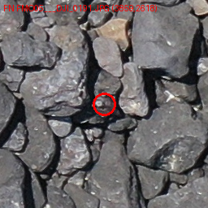 | DJI_0191 (3859, 2618) | Tiny iguana in a rock crevice — heavy camouflage |
| 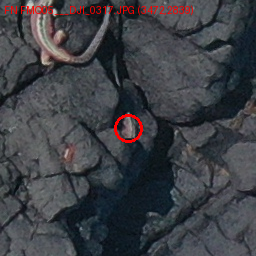 | DJI_0317 (3472, 2839) | Small dark iguana on dark cracked rock |
| 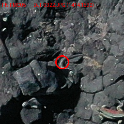 | DJI_0322 (1414, 1592) | Barely-visible iguana on rock |
| 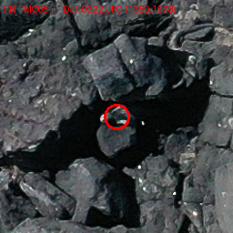 | DJI_0322 (1350, 1678) | Partial body, dark on dark |
| 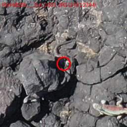 | DJI_0331 (2191, 2764) | Very small individual |

### Stitcher-boundary alignment (1 of 9)

| crop | location | what it is |
|---|---|---|
| 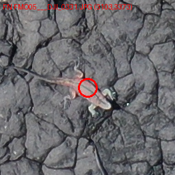 | DJI_0331 (3103, **3373**) | A *clearly visible* orange iguana in full silhouette pose on dark cracked rock — bright contrast, distinct legs/tail. There's no obvious reason the model should have missed this except that y=3373 sits very close to a stitcher tile boundary (frame is 3648 tall, tile size 512, overlap 120 → bottom row starts around y=3136, ends at y=3648; the iguana centre likely lands in an unfortunate boundary region of the bottom-row tiles). |

## False positives — 11 ghost detections (top 6 high-confidence shown)

Predicted location marked with orange circle.

### Image-edge / corner artifacts (3 of 6 high-conf)

| crop | location | score | what it is |
|---|---|---|---|
| 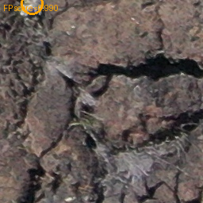 | DJI_0270 (**40, 4**) | 0.990 | **Literal top-left corner of the image** — score 0.99 on volcanic-rock crack patterns. Stitcher's partial-overlap region near the (0, 0) corner produces an overconfident peak. |
| 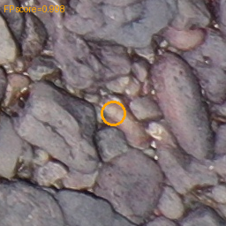 | DJI_0141 (**5244**, 3508) | 0.998 | Right edge (frame 5472 wide — only 228 px to right border). Ordinary rock crevice pattern triggers near-1.0 confidence. |
| 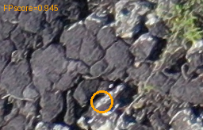 | DJI_0157 (320, **3612**) | 0.945 | Bottom-left edge area, fractured volcanic rock. |

### Wet / glossy basalt (1 of 6 high-conf)

| crop | location | score | what it is |
|---|---|---|---|
| 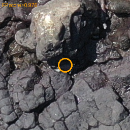 | DJI_0331 (2568, 1936) | 0.975 | Water-glazed black volcanic rock with specular highlights mimicking the wet sheen of iguana skin. The shape isn't iguana-like but the texture cue is enough. |

### Iguana-silhouette rock fragments (2 of 6 high-conf)

| crop | location | score | what it is |
|---|---|---|---|
| 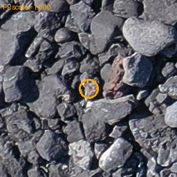 | DJI_0331 (868, 2620) | **1.000** | A small dark angular rock fragment surrounded by lighter pebbles. The aerial silhouette geometrically resembles a curled iguana. **Maximum confidence** — the model is fully convinced. |
| 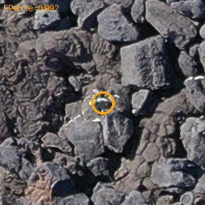 | DJI_0157 (1284, 576) | 0.992 | A lighter rock patch shaped like a small curled body amongst dark fractured rocks. Same silhouette-mimic pattern. |

### Lower-confidence FPs (5 remaining, scores 0.027–0.695)

These are less concerning — they would be filtered out by raising the threshold a notch (e.g. ts=0.35 cuts 4 of these 5). Listed in `assets/error_analysis/fp_by_score.csv` for completeness.

## Pattern summary

| Failure class | Count | Where it lives | Likely root cause |
|---|---|---|---|
| Edge FN | 3 | y<10 or y>3640 | Iguana cut off by frame border + stitcher's lowest-overlap region near borders |
| Edge / corner hi-conf FP | 3 | image corners, near-edge tiles | Stitcher partial-tile context produces overconfident peaks |
| Hard-camouflage FN | 5 | small dark iguanas on dark rock | Genuine recall ceiling — limited training signal for these |
| Stitcher-boundary FN | 1 | y near tile-row boundary | Iguana centre lands in disadvantageous tile alignment despite having stitcher overlap |
| Wet/glossy rock FP | 1 | reflective volcanic surfaces | Specular-highlight texture mimics iguana skin sheen |
| Iguana-silhouette rock FP | 2 | angular dark fragments among lighter rocks | Geometric silhouette match to learned iguana profile |

## Practical takeaway

**Roughly 6 of 20 errors (30 %) are clustered at image borders** — 3 edge FNs and 3 corner/edge high-confidence FPs. This is a single-fix opportunity: bump the stitcher overlap or pad the input.

Cheapest experiments worth running, ranked:

1. **Stitcher overlap 120 → 256** (1-line Hydra override `+training_settings.stitcher.kwargs.overlap=256`). Existing checkpoints, no retraining. ~30 min sweep. Could remove most of the edge-cluster (~6 errors).
2. **Reflection-pad input by 64 px before stitching**. Adds frame-border context. Same checkpoints, modify `HerdNetStitcher` to pad before tiling. Targets the same edge-cluster; cleaner conceptually than overlap tuning.
3. **Hard-negative mining on the 6 high-confidence FPs**. Crop each FP region as a "background" patch, add to training set with a 0-target, retrain B4. Targets the hi-conf FP class. ~1.5 h retraining.
4. **Higher-resolution training (down_ratio 4 → 2)**. Targets the hard-camouflage FN class — more receptive-field detail for small dark iguanas. Expensive (4× memory, longer training) and may not help if the bottleneck is data, not resolution.

The hard-camouflage FN bucket (5 of 20 errors) is the recall ceiling. Pushing past it likely requires either (a) more diverse training data, including more low-contrast iguanas, or (b) higher input resolution. Neither is a free lunch.

The stitcher-boundary FN (FN_008) is interesting because the iguana is *clearly visible* — a single uncomfortable tile alignment cost us a real detection. Suggests inference-side multi-grid stitching (run inference at two grid offsets and union) might be worth a small experiment.

## Artifacts

- All 9 FN crops: `docs/benchmarks/assets/error_analysis/fn/`
- All 11 FP crops: `docs/benchmarks/assets/error_analysis/fp/` (annotated with confidence score)
- Source detections: `output/phase6_sweep_20260507_124034/ENS3/ts_0.30_ttaFalse/detections.csv`
- Source GT: `data_fmo03/val/herdnet_format.csv`
- FN list: `docs/benchmarks/assets/error_analysis/fn.csv`
- FP list (sorted by score desc): `docs/benchmarks/assets/error_analysis/fp_by_score.csv`
- Analysis script: `/tmp/error_analysis.py` (also reproducible from the inputs above)
